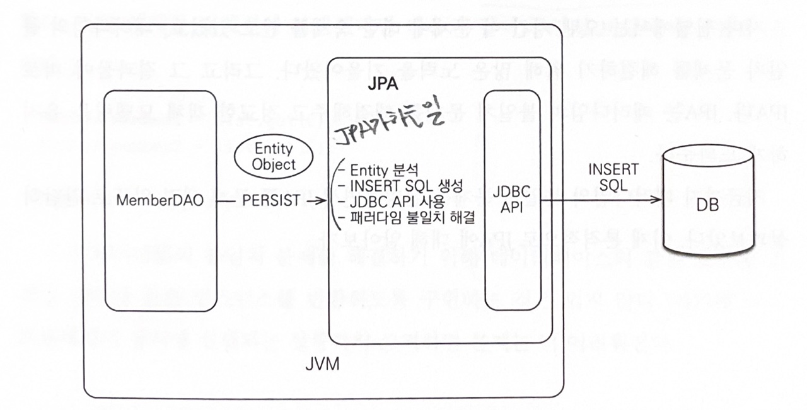

## SQL을 직접 다룰 때 발생하는 문제점
- 관계형 데이터베이스는 가장 대중적이고 신뢰할 만한 안전한 데이터 저장소
- 자바로 개발하는 애플리케이션은 대부분 관계형데이터베이스를 저장소로 사용
- 데이터베이스에 데이터를 관리하려면 SQL을 사용해야 함

### 반복에 관하여

#### 조회
1. 회원 조회용 SQL 작성
2. JDBC API를 사용해서 SQL을 실행
3. 조회 결과를 Member 객체로 매핑 (setter)

#### 등록
1. 회원 등록용 SQL을 작성
2. 회원 객체의 값을 꺼내서 등록 SQL에 전달
3. JDBC API 를 사용해서 SQL을 실행

수정, 삭제를 마찬가지로 비슷하게 반복..

### DB가 아닌 자바 컬렉션에 보관한다면? 
`list.add(member)` 로 저장 가능

	하지만 데이터베이스는 객체구조와는 다른 데이터 중심의 구조를 가지므로 객체를 DB에 직접 저장, 조회X

중간에서 SQL 과 JDBC API를 사용해서 변환 작업을 직접 해줘야 함

하지만, 객체를 DB에 CRUD 하려면 많은 SQL과 JDBC API를 코드로 작성해야 함

### SQL에 의존적인 개발

1. 등록 코드 변경 - SQL과 JDBC API 수정
2. 조회 코드 변경 - SQL 수정, 객체에 매핑
3. 수정 코드 변경 - SQL update 수정

만약 객체를 데이터베이스가 아닌 자바 컬렉션에 보관했다면 필드를 추가한다고 해서 많은 코드를 수정할 필요는 없을 것이다.
```
list.add(member); //등록
Member member = list.get(xx); // 조회
member.setTel("xx"); // 수정
```

#### 문제점
- 데이터 접근 계층을 사용해서 SQL을 숨겨도 어쩔 수 없이 DAO를 열어서 어떤 SQL이 실행되는지 확인해야 한다.
- 비즈니스 요구사항을 모델링한 객체를 엔티티라고 하는데 SQL에 모든 것을 의존하는 상황에서는 개발자들이 엔티티를 신뢰하고 사용할 수 없다.
- DAO를 열어서 어떤 SQL이 실행되고 어떤 객체들이 함께 조회되는지 일일이 확인해야 한다.
- 논리적으로 엔티티와 강한 의존관계
- 필들를 추가할 때도 DAO의 CRUD 코드와 SQL대부분을 변경해야 하는 문제가 발생한다.

1. 진정한 의미의 계층 분할이 어렵다.
2. 엔티티를 신뢰할 수 없다.
3. SQL에 의존적인 개발을 피하기 어렵다.

#### JPA와 문제 해결
JPA를 사용하면 객체를 데이터베이스에 저장하고 관리할 때, 개발자가 직접 SQL을 작성하는 것이 아니라 JPA가 제공하는 API를 사용하면 된다. 그러면 JPA가 적절한 SQL을 생성해서 데이터베이스에 전달한다.

1. 저장 기능
	1. persist() 객체를 데이터베이스에 저장한다. 객체와 매핑정보를 보고 적절한 INSERT SQL을 생성해서 데이터베이스에 전달한다.
2. 조회 기능
	1. find() 객체하나를 데이터베이스에서 조회한다. SELECT SQL을 생성해서 데이터베이스에 전달하고 그 결과로 객체를 생성해서 반환한다.
3. 수정 기능
	1. 별도의 수정기능을 제공하지 않는다. 대신 객체를 조회해서 값을 변경만 하면 트랜잭션을 커밋할 때 데이터베이스에 적절한 UPDATE SQL이 전달된다.
4. 연관된 객체 조회
	1. JPA는 연관된 객체를 사용하는 시점에 적절한 SELECT SQL을 실행한다.

### 패러다임의 불일치
	지속 가능한 애플리케이션을 개발하는 일은 끊임없이 증가하는 복잡성과의 싸움이다. 복잡성을 제어하지 못하면 결국 유지보수하기 어려운 애플리케이션이 된다.

비즈니스 요구사항을 정의한 도메인 모델도 객체로 모델링하면 객체지향 언어가 가진 장점들을 활용할 수 있다.
문제는 모델을 저장할 때 객체를 메모리가 아닌 어딘가에 영구 보관해야한다.
객체가 단순하면 데이터베이스에 모든 속성을 꺼내 저장하면 되지만, 상속 혹은 참고하고 있다면 저장하기가 쉽지 않다.
현실적인 대안은 관계형 데이터베이스에 객체를 저장하는 것인데, 관계형 데이터베이스는 데이터 중심으로 구조화되어 있고 집합적인 사고를 요구한다. 그리고 객체지향에서 나오는 추상화, 상속, 다형성 같은 개념이 없다.
그래서 이러한 패러다임의 불일치 문제를 개발자가 중간에서 해결해야 한다.
그러나 이 문제를 해결하기 위해 너무 많은 시간과 코드를 소비해야한다.

#### 상속
JPA는 상속과 관련된 패러다임의 불일치 문제를 마치 자바 컬렉션에 저장하듯이 JPA에게 객체를 저장하면 된다.

#### 연관관계
객체는 참조를 사용하여 참조에 접근해서 연관된 객체를 조회함
반면에, 테이블은 외래키를 사용해서 다른 테이블을 조인하여 연관된 테이블을 조회한다.
참조를 사용하는 객체와 외래키를 사용하는 테이블 사이의 패러다임의 불일치를 해결하는 것은 무척 어렵다.
- 객체는 참조가 있는 방향으로만 조회할 수 있다.
- 테이블은 외래키 하나로 서로를 조회할 수 있다.

외래키를 참조하는 방식을 사용하면 해결되지 않으므로 객체자체를 참조하여 모델링을 해줘야 한다.
객체지향 모델링을 사용하면 객체를 테이블에 저장하거나 조회하기가 쉽지 않다.
- 객체 모델은 외래키가 필요없고 단지 참조만 있으면 된다.
- 테이블은 참조가 필요 없고 외래키만 있으면 된다.
- 결국 개발자가 중간에서 변환 역할을 해야 한다.

이러 과정들은 불일치를 해결하려고 소모하는 비용이다.
만약 자바 컬렉션에 회원 객체를 저장한다면 이런 비용이 들지 않는다.

#### JPA와 연관관계
JPA는 team의 참조를 외래키로 변환해서 적절한 INSERT SQL을 데이터베이스에 전달한다.
객체를 조회할 때 외래키를 참조로 변환하는 일도 JPA가 처리해준다.
```
Member member = jpa.find(Member.class, memeberId);
Team team = member.getTeam();
```

#### 객체 그래프 탐색
`member.getOrder().getOrderItem();
객체는 마음껏 객체 그래프를 탐색할 수 있어야 합니다.
SQL을 직접 다루면 처음 실행하는 SQL에 따라 객체 그래프를 어디까지 탐색할 수 있는지 정해집니다.
이는 비즈니스 로직에 따라 사용하는 객체 그래프가 달라 언제 끊어질지 모르는 제약이 있습니다.

#### JPA와 객체 그래프 탐색
JPA를 사용하면 객체 그래프를 마음껏 탐색할 수 있습니다.
JPA는 연관된 객체를 사용하는 시점에 적절한 SQL을 실행합니다. 따라서 JPA를 사용하면 연관된 객체를 신뢰하고 마음껏 조회할 수 있습니다. 
이 기능은 실제 객체를 사용하는 시점까지 데이터베이스 조회를 미룬다고 해서 **지연로딩**이라고 합니다.
JPA는 연관된 객체를 즉시 함께 조회할지 아니면 실제 사용되는 시점에 지연해서 조회할지를 간단한 설정으로 정의할 수 있습니다.

#### 비교
- 동일성 비교는 == 비교 -> 객체 인스턴스의 주소 값을 비교함
- 동등성 비교는 equals() 메서드를 사용해서 객체 내부의 값을 비교함.

#### JPA와 비교
JPA는 같은 트랜잭션일 때 같은 객체가 조회되는 것을 보장합니다.
```
String id = "100";
Mem mem1 = jpa.find(Mem.class, id);
Mem mem2 = jpa.find(Mem.class, id);
mem1 == mem2 // 같다.
```

### 정리
객체 모델링과 관계형데이터베이스 모델은 지향하는 패러다임이 다르다. 이 패러다임의 차이를 극복하려고 개발자가 너무 많은 시간과 코드를 소비한다.
정교한 객체 모델링을 할수록 패러다임의 불일치 문제가 더 커진다.
결국, 객체 모델링은 힘을 잃고 점점 데이터 중심의 모델로 변해간다.
이를 해결하는 것이 **JPA**다. 패러다임의 불일치 문제를 해결해주고 정교한 객체 모델링을 유지하게 도와준다.


## JPA란 무엇인가?
JPA는 자바 진영의 ORM 기술 표준이다. 애플리케이션과 JDBC 사이에서 동작한다.

#### ORM 이란?
Object - Relational - Mapping 객체와 관계형데이터베이스를 매핑한다.
ORM 프레임워크는 객체와 테이블을 매핑해서 패러다임의 불일치 문제를 개발자 대신 해결해준다.



![[KakaoTalk_Photo_2023-07-12-14-56-34 001.jpeg]]

객체 측면에서는 정교한 객체 모델링을 할 수 있고 관계형 데이터베이스는 데이터베이스에 맞도록 모델링하면 된다. 이 둘 사이의 매핑 방법만 ORM 프레임워크에게 알려주면 된다.
덕분에 개발자는 데이터 중심인 관계형 데이터베이스를 사용해도 객체지향 어플리케이션 개발에 집중할 수 있다.

각 프레임워크의 성숙도에 따라 단순히 객체 하나를 CRUD 하는 것부터 패러다임 불일치 문제를 대부분 해결해주는 ORM 프레임워크도 있다. 자바 진영의 대표 프레임워크는 하이버네이트 프레임워크가 가장 많이 사용된다.

![[KakaoTalk_Photo_2023-07-12-15-04-23.jpeg]]
JPA는 자바 ORM 기술에 대한 API 표준 명세다. (인터페이스를 모아둔 것이다.)
JPA라는 표준 덕분에 특정 구현 기술에 대한 의존도를 줄일 수 있고 다른 구현 기술로 손쉽게 이동할 수 있는 장점이 있다.

### 왜 JPA를 사용해야 하는가?
1. 생산성
	1. 자바 컬렉션에 저장하듯이 JPA에게 저장할 객체를 전달하면 된다.
	2. 반복적인 일은 JPA가 대신 처리해준다.
	3. JPA에는 DDL문을 자동으로 생성해주는 기능도 있다.
	4. 객체 설계 중심으로 역전시킬 수 있다.
2. 유지보수
	1. 필드를 추가하거나 삭제해도 수정해야 할 코드가 줄어든다. 
	2. 유지보수해야 하는 코드 수가 줄어든다.
3. 패러다임의 불일치 해결
	1. JPA는 상소그 연관관계, 객체 그래프 탐색, 비교하기와 같은 패러다임의 불일치 문제를 해결해준다.
4. 성능
	1. 다양한 성능 최적화 기회를 제공한다.
	2. JPA는 애플리케이션과 데이터베이스 사이에서 작동한다. 최적화 관점에서 시도해 볼 수 있는 것들이 많다.
5. 데이터 접근 추상화와 벤더 독립성
	1. 관계형 데이터베이스는 같은 기능도 벤더마다 사용법이 다른 경우가 많다.
	2. 데이터 베이스 기술에 종속되고 다른 데이터베이스로 변경하기는 매우 어렵다.
	3. 특정 데이터베이스 기술에 종속되지 않도록 한다.
	4. JPA에게 다른 데이터베이스를 사용한다고 알려주기만 하면 된다.

![[KakaoTalk_Photo_2023-07-12-15-13-07.jpeg]]
